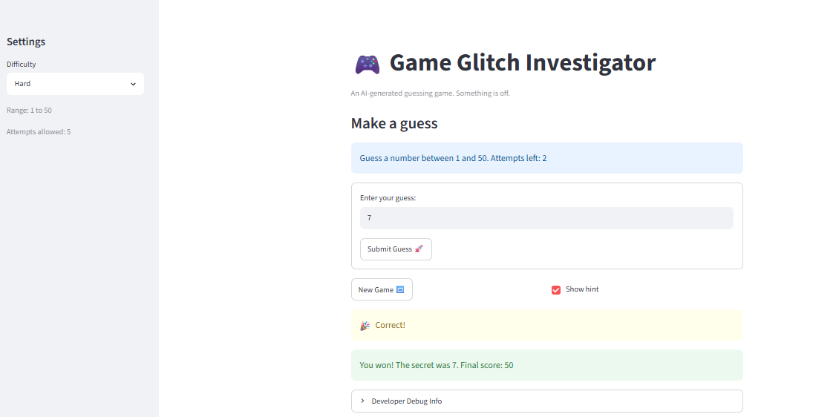

# 🎮 Game Glitch Investigator: The Impossible Guesser

## 🚨 The Situation

You asked an AI to build a simple "Number Guessing Game" using Streamlit.
It wrote the code, ran away, and now the game is unplayable. 

- You can't win.
- The hints lie to you.
- The secret number seems to have commitment issues.

## 🛠️ Setup

1. Install dependencies: `pip install -r requirements.txt`
2. Run the broken app: `python -m streamlit run app.py`

## 🕵️‍♂️ Your Mission

1. **Play the game.** Open the "Developer Debug Info" tab in the app to see the secret number. Try to win.
2. **Find the State Bug.** Why does the secret number change every time you click "Submit"? Ask ChatGPT: *"How do I keep a variable from resetting in Streamlit when I click a button?"*
3. **Fix the Logic.** The hints ("Higher/Lower") are wrong. Fix them.
4. **Refactor & Test.** - Move the logic into `logic_utils.py`.
   - Run `pytest` in your terminal.
   - Keep fixing until all tests pass!

## 📝 Document Your Experience

- [x] Describe the game's purpose.
   --- The game is a number-guessign app where the player tries to discover a hidden secret number within a chosen difficulty range. The goal is to make guesses, and win before running out of attempts. 
- [x] Detail which bugs you found.
   ---- I found several bugs that made the game behave incorrectly: 
      1. The UI message "Guess a number between 1 and 50. Attempts left" was off, it was hard coded instead of being dynamically changing by the level difficulty.
      2. The secret number was changing and the hint messages sometimes pointed in the wrong direction
      3. The attempt counter was off 
      4. The UI message "Ran out of attempts. The secret was 7. Final Score -20" was displayed before the last attempt. 
      
- [x] Explain what fixes you applied.
    -- We fix the game by keepint the secret number and game state in session storage, 
    -- corrected the too "high" and "too low" messages were accurate 
    -- move the core logic rules into the logic_utils.py so it can be separated from the app.py
    -- updated the attempts counter and score so when it was submitted it will stay in sync with the gameplay. 

## 📸 Demo Walkthrough

Describe your fixed game in numbered steps so a reader can follow along without watching a video:

1. Open the app and choose the difficulty level, I am choosing Hard
2. We have to guess a number between 1 and 50 and have, 5 attempts
3. The user enters 25 and hits submit 
4. The game return "GO LOWER!"
5. Then I enter 15 and  hit submit
6. The game return "GO LOWER!"
7. Then I enter 7 
8. I get ballons in the screen saying! "Correct!" "You won! The secret was 7. Final Score: 50"

**Screenshot** *(optional)*:



## 🧪 Test Results

```
# $ python -m pytest -q
....................                                                                                                                                                                                                                                            [100%]
20 passed in 0.12s
```

## 🚀 Stretch Features

- [ ] [If you choose to complete Challenge 4, describe the Enhanced UI changes here — a screenshot is optional]
